# Day 1 run-sheet — Monday 28 September 2026 (all times IST)

Everything here is final. Text, logo, badge and the `manasyn.app` watermark are already inside the images — nothing to edit.
For each slot: attach the file(s) listed, copy the caption box, paste the alt text, publish. Same captions also sit in `captions/` as plain `.txt`.

**Handles:** Instagram / Threads **@manasynapp** · X **@Manasynapp** · LinkedIn **linkedin.com/company/manasyn** · Facebook **facebook.com/people/Manasyn/61594022532492/**
**Hashtag rotation:** Day 1 uses Set A (Set B tomorrow, Set C the day after — all three sets are at the end of `../DAY-01-CONTENT.md`).

## Schedule at a glance

| Time (IST) | Platform | Post | Attach | Caption file |
|---|---|---|---|---|
| 8:00 AM | Instagram | 1 | `post1/post1-portrait-1080x1350.jpg`<br>`post1/post1-story-1080x1920.jpg` | `captions/post1/instagram.txt` |
| 8:00 AM | X | 1 | `post1/post1-square-1080x1080.jpg` | `captions/post1/x.txt` |
| 8:15 AM | Threads | 1 | `post1/post1-square-1080x1080.jpg` | `captions/post1/threads.txt` |
| 8:30 AM | Facebook | 1 | `post1/post1-portrait-1080x1350.jpg` | `captions/post1/facebook.txt` |
| 9:00 AM | LinkedIn | 1 | `post1/post1-portrait-1080x1350.jpg` | `captions/post1/linkedin.txt` |
| 9:00 AM | Pinterest | 1 | `post1/post1-pinterest-1000x1500.jpg` | `captions/post1/pinterest.txt` |
| 1:00 PM | Instagram | 2 | `post2/post2-portrait-1080x1350.jpg`<br>`post2/post2-story-1080x1920.jpg` | `captions/post2/instagram.txt` |
| 1:00 PM | X | 2 | `post2/post2-square-1080x1080.jpg` | `captions/post2/x.txt` |
| 1:00 PM | Pinterest | 2 | `post2/post2-pinterest-1000x1500.jpg` | `captions/post2/pinterest.txt` |
| 1:00 PM | LinkedIn (optional) | 2 | `post2/post2-portrait-1080x1350.jpg` | `captions/post2/linkedin.txt` |
| 1:15 PM | Threads | 2 | `post2/post2-square-1080x1080.jpg` | `captions/post2/threads.txt` |
| 1:30 PM | Facebook | 2 | `post2/post2-square-1080x1080.jpg` | `captions/post2/facebook.txt` |
| 2:00 PM | Reddit | 2 | `post2/post2-square-1080x1080.jpg` | `captions/post2/reddit.txt` |
| 7:00 PM | Instagram | 3 | 9 images (see section) | `captions/post3/instagram.txt` |
| 7:00 PM | X | 3 | 7 images (see section) | `captions/post3/x.txt` |
| 7:00 PM | LinkedIn | 3 | `post3/post3-carousel-linkedin.pdf` | `captions/post3/linkedin.txt` |
| 7:15 PM | Threads | 3 | `post3/post3-slide-01.jpg` | `captions/post3/threads.txt` |
| 7:30 PM | Facebook | 3 | 8 images (see section) | `captions/post3/facebook.txt` |
| 7:30 PM | Pinterest | 3 | `post3/post3-pinterest-1000x1500.jpg` | `captions/post3/pinterest.txt` |
| 8:00 PM | Reddit | 3 | 6 images (see section) | `captions/post3/reddit.txt` |

## Files in this folder

| Folder | Files |
|---|---|
| `post1/` | `post1-square-1080x1080.jpg` (X, Threads) · `post1-portrait-1080x1350.jpg` (IG, FB, LinkedIn) · `post1-story-1080x1920.jpg` (IG Story) · `post1-pinterest-1000x1500.jpg` |
| `post2/` | `post2-square-1080x1080.jpg` (X, Threads, FB, Reddit) · `post2-portrait-1080x1350.jpg` (IG, LinkedIn) · `post2-story-1080x1920.jpg` · `post2-pinterest-1000x1500.jpg` |
| `post3/` | `post3-slide-01.jpg` … `post3-slide-08.jpg` (carousel, in order) · `post3-carousel-linkedin.pdf` · `post3-story-1080x1920.jpg` · `post3-pinterest-1000x1500.jpg` |
| `captions/postN/` | `instagram` · `facebook` · `x` · `linkedin` · `threads` · `pinterest` · `reddit` · `alt-text` · `references` (`.txt`) |

---

## 8:00 AM · Instagram · Post 1

**Manasyn Spotlight — AI Companion** — *8:00 AM · Hinglish · hashtags go in FIRST COMMENT*

**Attach:**

- `post1/post1-portrait-1080x1350.jpg` — feed post
- `post1/post1-story-1080x1920.jpg` — Story — add a link sticker → manasyn.app

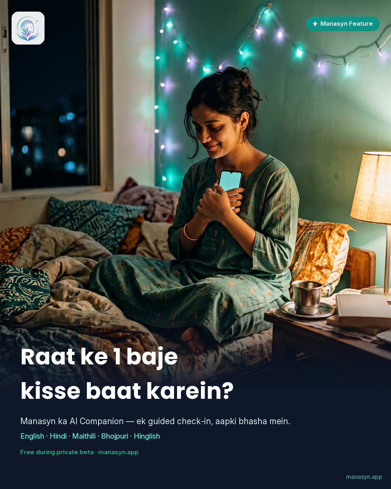 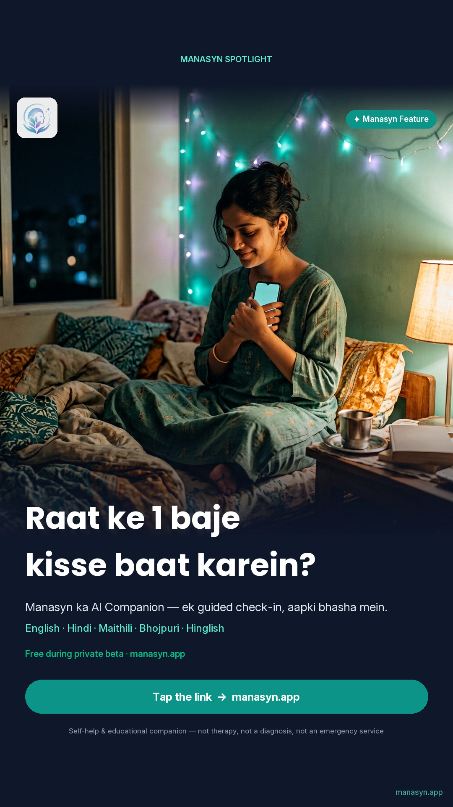

**Caption:**

```text
Raat ke 1:12 baje. Sab so gaye. Aur aap? Chhat ko ghoor rahe ho. 🌙

Dimaag mein 50 tabs khule hain — kal ki presentation, woh message jiska reply nahi aaya, Mummy ki tabiyat, aur ek ajeeb si bechaini jiska naam bhi nahi pata.

Kisi ko call karein? "Itni raat ko? Aur bolenge kya?"
Toh phir scroll. Aur scroll. 📱

Yahin se Manasyn ka AI Companion shuru hota hai. 💚

Yeh woh chatbot nahi hai jo "I understand" bolke chup ho jaaye.
Yeh ek guided check-in hai — jo sahi agla sawaal poochta rehta hai, jab tak sach mein samajh na jaaye ki aap kahan ho.

✨ English, हिंदी, मैथिली, भोजपुरी — ya pure Hinglish mein. Jaise sochte ho, waise bolo.
• Aapke mood, neend, stress aur risk signals ko notice karta hai.
• End mein ek chhoti report banti hai — jo aap apne psychologist ke saath share kar sakte ho.

Research kehti hai: log ek non-judgmental AI ke saamne zyada khul ke bolte hain, kyunki "koi judge nahi kar raha" (Lucas et al., 2014). Aur feelings apni bhasha mein zyada sahi nikalti hain (Santiago-Rivera & Altarriba, 2002).

Saaf baat: Manasyn therapy nahi hai. Diagnosis nahi hai. Kisi psychologist ki jagah nahi le sakta.
Lekin woh pehli baatcheet — jo aksar sabse mushkil hoti hai — yahan se shuru ho sakti hai. 🌱

Abhi private beta mein bilkul free.
👉 Link in bio | manasyn.app

Ek sawaal: jab dimaag raat ko band nahi hota, aap kya karte ho? Comment mein batao 👇

—
🆘 Emergency: 112 · Tele-MANAS: 14416 (24×7) · iCall: 9152987821 (Mon–Sat, 10 AM–8 PM) · Manasyn is not an emergency service.
📚 Sources: Lucas et al., 2014 | Santiago-Rivera & Altarriba, 2002 | Full refs in bio link
```

**First comment (hashtags — Set A):**

```text
#manasyn #manasynapp #mindcareai #MentalHealthApp #AICompanion #MindcareIndia #MentalHealthIndia #MentalWellness #Overthinking #OverthinkingAtNight #AnxietyRelief #MentalHealthMatters #MentalHealthAwareness #EmotionalWellbeing #SelfHelpIndia #DesiMentalHealth #HindiMentalHealth #SelfCareIndia #WellnessIndia #MindMatters #TalkAboutIt #ItsOkayToNotBeOkay #StartTheConversation #IndianWellness #ManasynAI
```

**Alt text:** Young Indian woman smiling softly at her phone in a lamp-lit room at night — Manasyn AI Companion check-in.

**How:** Paste the caption → publish → immediately paste the hashtag block as your own **first comment**. Alt text: *Advanced settings → Write alt text*. Then post the Story and add the link sticker.

---
## 8:00 AM · X · Post 1

**Manasyn Spotlight — AI Companion** — *8:00 AM · single tweet + one reply*

**Attach:**

- `post1/post1-square-1080x1080.jpg` — on tweet 1

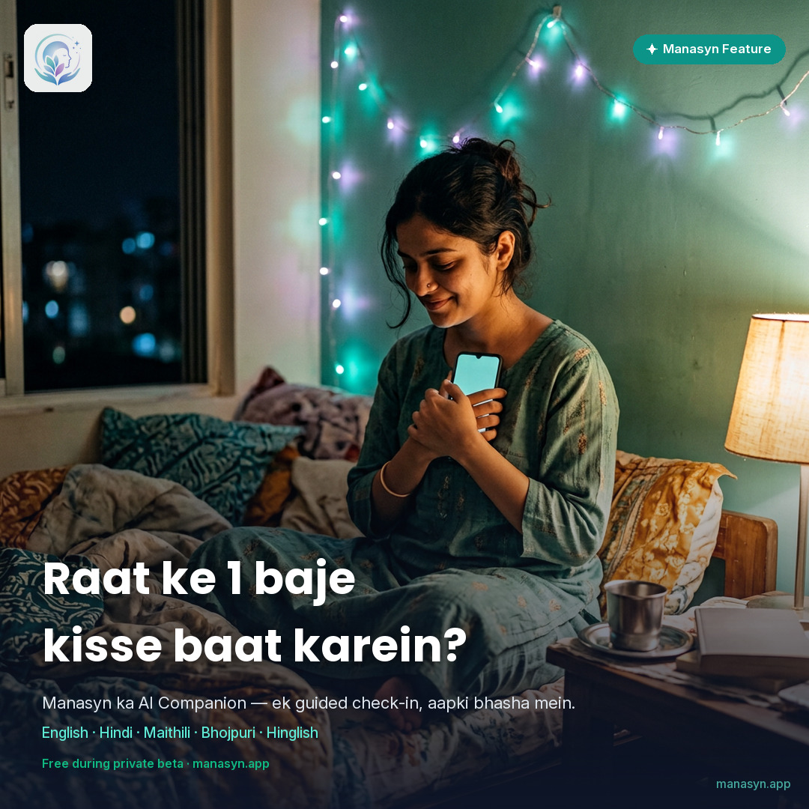

**Tweet 1** — attach `post1/post1-square-1080x1080.jpg` (265 chars)

```text
1 AM. Everyone's asleep. You aren't.

Manasyn's AI Companion is a guided check-in, not a chatbot: the right next question, in English, Hindi, Maithili or Bhojpuri, plus a report for your psychologist. Free in beta 💚

manasyn.app #MentalHealth #MindCare
```

**Reply** (177 chars)

```text
Not therapy, not a diagnosis, not an emergency service — a first conversation, in your language. 🆘 India: 112 · Tele-MANAS 14416 (24×7) · iCall 9152987821 (Mon–Sat, 10 AM–8 PM)
```

**Alt text:** Young Indian woman smiling softly at her phone in a lamp-lit room at night — Manasyn AI Companion check-in.

**How:** One tweet per box below, each as a reply to the previous one (a thread). Add alt text on the image (*+ALT*).

---
## 8:15 AM · Threads · Post 1

**Manasyn Spotlight — AI Companion** — *8:15 AM · casual Hinglish*

**Attach:**

- `post1/post1-square-1080x1080.jpg`


**Caption:**

```text
raat ke 1 baje wali feeling jaante ho? 🌙 jab sab so gaye aur dimaag ne overtime lagaya hua hai 😵‍💫

kisi ko msg karo toh "kya bolun" wala problem.

isliye @manasynapp pe ek AI Companion hai — chatbot nahi, ek guided check-in. sahi sawaal poochta hai, aapki bhasha mein (हिंदी / मैथिली / भोजपुरी / English / Hinglish), aur end mein ek chhoti report deta hai jo aap psychologist ko dikha sako 💚

therapy nahi hai, diagnosis nahi hai — bas woh pehli baat jo sabse mushkil hoti hai 🌱

private beta mein free → manasyn.app

btw aap raat ko dimaag kaise shaant karte ho? 👇

#Manasyn #MentalHealthIndia #Overthinking #AICompanion
```

**Alt text:** Young Indian woman smiling softly at her phone in a lamp-lit room at night — Manasyn AI Companion check-in.

**How:** Casual tone is intentional (lower-case Hinglish). Same image as X.

---
## 8:30 AM · Facebook · Post 1

**Manasyn Spotlight — AI Companion** — *8:30 AM · simple Hindi + English*

**Attach:**

- `post1/post1-portrait-1080x1350.jpg`


**Caption:**

```text
Kal raat aap kitne baje soye? 🌙

Ek scene describe karte hain — dekhiye kitna familiar lagta hai.

Raat ke 1 baje. Ghar mein sab so chuke hain. Aap bistar pe hain, phone haath mein, aur dimaag band hone ka naam nahi le raha. Kal ka kaam, kisi ki baat jo chubh gayi, paise ki tension, ya bas ek bhaaripan jiska koi kaaran samajh nahi aata.

Aap sochte ho — kisi se baat kar loon? Lekin phir: "Itni raat ko kaun uthega? Aur bolunga kya — 'mujhe pata nahi kya ho raha hai'?"

Isi "pata nahi kya ho raha hai" ke liye humne Manasyn ka AI Companion banaya hai.

Yeh ek chatbot nahi hai. Yeh ek guided check-in hai — jaise ek samajhdaar dost jo sahi sawaal poochta hai: "Neend kaisi chal rahi hai?" "Din mein kab sabse zyada bhaari lagta hai?" — jab tak baat saaf na ho jaaye.

Aap English, हिंदी, मैथिली ya भोजपुरी mein baat kar sakte hain — Hinglish mein bhi. Kyunki feelings apni bhasha mein zyada sahi nikalti hain.

Yeh aapke mood, neend, stress aur risk signals ko note karta hai, aur ek chhoti report banata hai jo aap apne psychologist ko dikha sakte hain — taaki pehli appointment "shuru se" na karni pade.

Research kya kehti hai: log ek non-judgmental AI ke saamne zyada khul kar bolte hain (Lucas et al., 2014). Aur India mein jinhe mental health care ki zaroorat hai, unmein se 84.5% ko koi treatment nahi milta (National Mental Health Survey, NIMHANS, 2015–16). Sabse bada gap pehle kadam ka hai.

Saaf baat: Manasyn therapy nahi hai, diagnosis nahi hai, aur kisi psychologist ya psychiatrist ki jagah nahi le sakta. Yeh pehli baatcheet hai — aakhri nahi.

Private beta mein abhi bilkul free hai. 💚
👉 manasyn.app

Fill in the blank 👇
"Raat ko jab neend nahi aati, main ______ karta/karti hoon."

🆘 Emergency: 112 · Tele-MANAS: 14416 (24×7) · iCall: 9152987821 (Mon–Sat, 10 AM–8 PM) · Manasyn is not an emergency service.

#Manasyn #MentalHealthIndia #AICompanion #SelfCare #MindcareIndia
```

**Alt text:** A young Indian woman sits cross-legged on her bed at night, holding her phone with a calm half-smile under warm lamplight and teal fairy lights. Overlay reads: Raat ke 1 baje kisse baat karein? Manasyn AI Companion, free in beta.

**How:** Normal photo post. Where the caption ends with a poll / fill-in-the-blank, add it in the composer (Poll) or just leave it in the text — both work.

---
## 9:00 AM · LinkedIn · Post 1

**Manasyn Spotlight — AI Companion** — *9:00 AM · professional English*

**Attach:**

- `post1/post1-portrait-1080x1350.jpg`


**Caption:**

```text
The hardest sentence in mental healthcare is the first one.

In India, 84.5% of people with a diagnosable mental health condition receive no treatment at all (National Mental Health Survey 2015–16, NIMHANS). We usually frame that number as a supply problem — about 0.75 psychiatrists per 100,000 people, against a desirable three or more. It is that. But it is also a first-step problem: the distance between "something feels off" and "I said it out loud to someone" is where most people stop.

Two research findings shaped how we built Manasyn's AI Companion.

1. People disclose more when they believe they aren't being judged. In a controlled study, participants who thought they were talking to a fully automated virtual interviewer reported lower fear of self-disclosure and showed more openness than those who believed a human was operating it (Lucas et al., 2014).

2. Emotion lives in the first language. Bilingual clients access emotional memories and describe feelings with more precision in their mother tongue (Santiago-Rivera & Altarriba, 2002). A check-in that only works in English quietly excludes most of India.

So the Companion is not a chatbot that says "I understand." It is a structured intake woven into a natural conversation: it keeps asking the right next question until it actually has a picture of your mood, sleep, stress and any risk signals — in English, Hindi, Maithili, Bhojpuri or Hinglish. At the end you get a short, shareable report you can hand to a psychologist, so the first professional appointment doesn't start from zero.

What it is not — and we say this inside the product, not just in the fine print: it is not therapy, not a diagnosis, and not a substitute for a psychologist or psychiatrist. It states its limits and points to human help when risk signals appear. We think that is the minimum standard for any AI touching mental health.

Personally, this feature exists because of the 1 AM problem — the hour when everyone you could call is asleep and "I'll deal with it tomorrow" becomes a habit. A good first question, in your own language, at that hour, can change what tomorrow looks like.

Manasyn is free during private beta.
Visit manasyn.app | Building mental healthcare for India 💚

If you work in mental health: what would you want an AI check-in to hand you before a first session — and what should it never attempt?

#MentalHealthIndia #DigitalMentalHealth #AIinHealthcare #MentalHealthApp #Psychology #HealthTech #Manasyn
```

**Alt text:** A young Indian woman sits cross-legged on her bed at night, holding her phone with a calm half-smile under warm lamplight and teal fairy lights. Overlay reads: Raat ke 1 baje kisse baat karein? Manasyn AI Companion, free in beta.

**How:** Post from the **Manasyn company page** (linkedin.com/company/manasyn), not a personal profile. Alt text: click the image → *Add alt text*.

---
## 9:00 AM · Pinterest · Post 1

**Manasyn Spotlight — AI Companion** — *2:3 pin · Board: Mental Health Tips India / Self Care India / Wellness Apps*

**Attach:**

- `post1/post1-pinterest-1000x1500.jpg` — destination link: https://manasyn.app

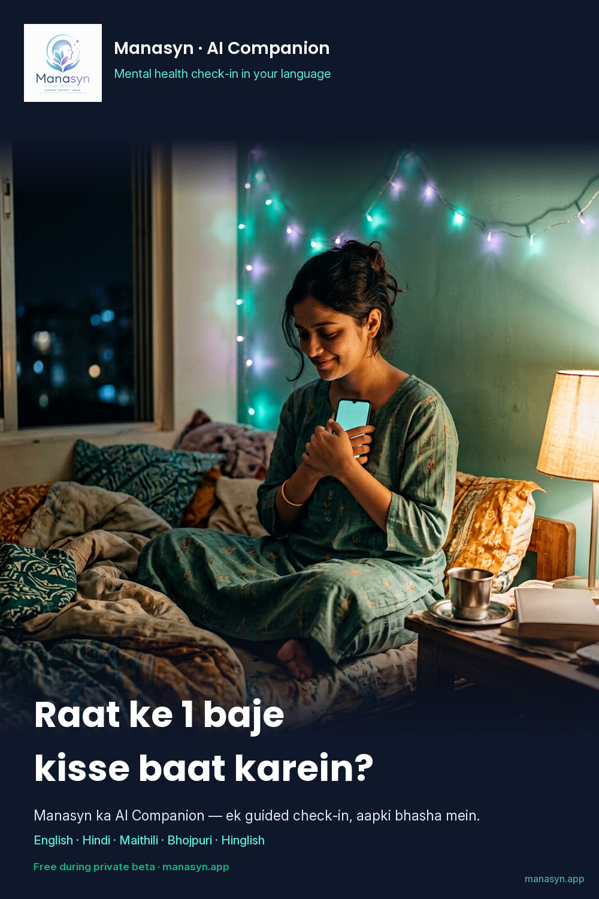

**Caption:**

```text
Title: Can't Switch Off Your Mind at 1 AM? Try a Guided Mental Health Check-In (Hindi, English, Maithili, Bhojpuri)

Description:
Late-night overthinking, racing thoughts and "who do I even talk to?" — sound familiar? Manasyn's AI Companion is a guided mental health check-in, not a chatbot. It asks the right next questions about your mood, sleep and stress, in your own language (English, Hindi, Maithili, Bhojpuri or Hinglish), and creates a simple report you can share with your psychologist. How it works: 1) Open manasyn.app on any phone browser — no download. 2) Pick your language and start a calm, structured check-in. 3) Get a short summary you can save or share with a professional. Free during private beta. Self-help and educational only — not therapy or diagnosis; if you're in crisis in India call 112 or Tele-MANAS 14416.

#MentalHealthIndia #MentalHealthApp #AICompanion #Overthinking #SelfCareIndia #AnxietyRelief #MentalWellness #HindiMentalHealth #SleeplessNights #SelfHelpTools #WellnessIndia #MindCare #Manasyn
```

**Alt text:** A young Indian woman sits cross-legged on her bed at night, holding her phone with a calm half-smile under warm lamplight and teal fairy lights. Overlay reads: Raat ke 1 baje kisse baat karein? Manasyn AI Companion, free in beta.

**How:** Title = the *Title:* line, description = the rest, set the destination link, pick the board named in the header.

---
## 1:00 PM · Instagram · Post 2

**Wellbeing Wisdom — Sleep** — *1:00 PM · Hinglish · hashtags in FIRST COMMENT*

**Attach:**

- `post2/post2-portrait-1080x1350.jpg` — feed post (square version also in post2/)
- `post2/post2-story-1080x1920.jpg` — Story — link sticker → manasyn.app

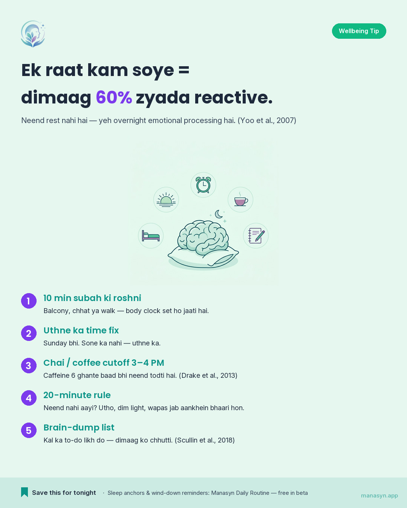 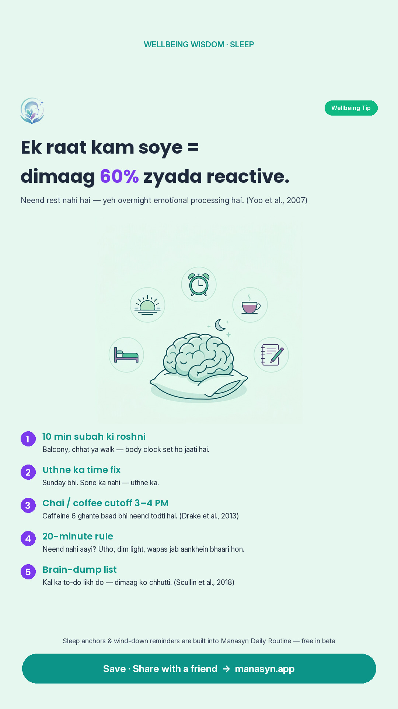

**Caption:**

```text
Kal raat 4–5 ghante soye, aur aaj har chhoti baat pe chidh ho rahi hai? 😤

Yeh aapka "character" nahi hai. Yeh aapka amygdala hai.

Ek brain-imaging study mein, sirf EK raat ki neend chhodne ke baad dimaag ka emotion centre (amygdala) negative cheezon pe 60% se zyada react karne laga — aur usse control karne wala prefrontal cortex "disconnect" ho gaya (Yoo et al., 2007). 🧠

Matlab: kam neend = brakes off, accelerator on.

Aur ulta bhi sach hai: 65 trials ke meta-analysis mein neend sudhaarne se depression, anxiety, rumination aur stress — sab mein sudhaar aaya (Scott et al., 2021). Neend bonus nahi, foundation hai. 🌙

Myth: "Main 5 ghante ka aadi ho gaya hoon."
Sach: 2 hafte 6 ghante sone waalon ko LAGA ki woh theek hain — performance roz girti gayi (Van Dongen et al., 2003). Adapt nahi hote, bas pata chalna band ho jaata hai.

5 sleep anchors jo aaj raat se kaam karte hain: ☀️
1. Subah 10 min roshni — balcony, chhat, walk.
2. UTHNE ka time fix — Sunday bhi. Sone ka nahi, uthne ka.
3. Chai/coffee cutoff 3–4 PM (6 ghante pehle wali caffeine bhi neend todti hai — Drake et al., 2013).
4. 20-minute rule: neend nahi aayi toh utho, dim light, boring kaam, wapas tab jab aankhein bhaari hon.
5. Brain-dump: kal ki to-do list likh do — log 9 min jaldi soye (Scullin et al., 2018). 📝

Save this for tonight 🔖 — aur us dost ko bhejo jo "bas ek aur episode" bolta hai.

Manasyn ke Daily Routine mein sleep anchors aur wind-down reminders built-in hain — free in beta. Link in bio | manasyn.app 💚

Aap ka sabse bada neend-chor kya hai — phone, chai, overthinking, ya "ek aur episode"? Comment karo 👇

—
Yeh general wellbeing tips hain, medical advice nahi. 3+ hafte se neend kharab hai toh doctor se milen.
🆘 Emergency: 112 · Tele-MANAS: 14416 (24×7) · iCall: 9152987821 (Mon–Sat, 10 AM–8 PM)
📚 Sources: Yoo et al., 2007 | Scott et al., 2021 | Van Dongen et al., 2003 | Drake et al., 2013 | Scullin et al., 2018 | Full refs in bio link
```

**First comment (hashtags — Set A):**

```text
#manasyn #manasynapp #mindcareai #WellbeingTips #MentalHealthIndia #SelfCare #SleepHealth #SleepHygiene #SleepBetter #SleepTips #SleepScience #BrainHealth #EmotionalHealth #StressRelief #AnxietyTips #HealthyHabits #WellnessIndia #MentalHealthAwareness #SelfCareIndia #Insomnia #NightOwl #StudentLife #HostelLife #Overthinking #MindBody
```

**Alt text:** Infographic: a brain resting on a pillow with five sleep-habit icons on mint — Manasyn sleep and mental health tips.

**How:** Paste the caption → publish → immediately paste the hashtag block as your own **first comment**. Alt text: *Advanced settings → Write alt text*. Then post the Story and add the link sticker.

---
## 1:00 PM · X · Post 2

**Wellbeing Wisdom — Sleep** — *1:00 PM · educational thread, 6 tweets*

**Attach:**

- `post2/post2-square-1080x1080.jpg` — on tweet 1

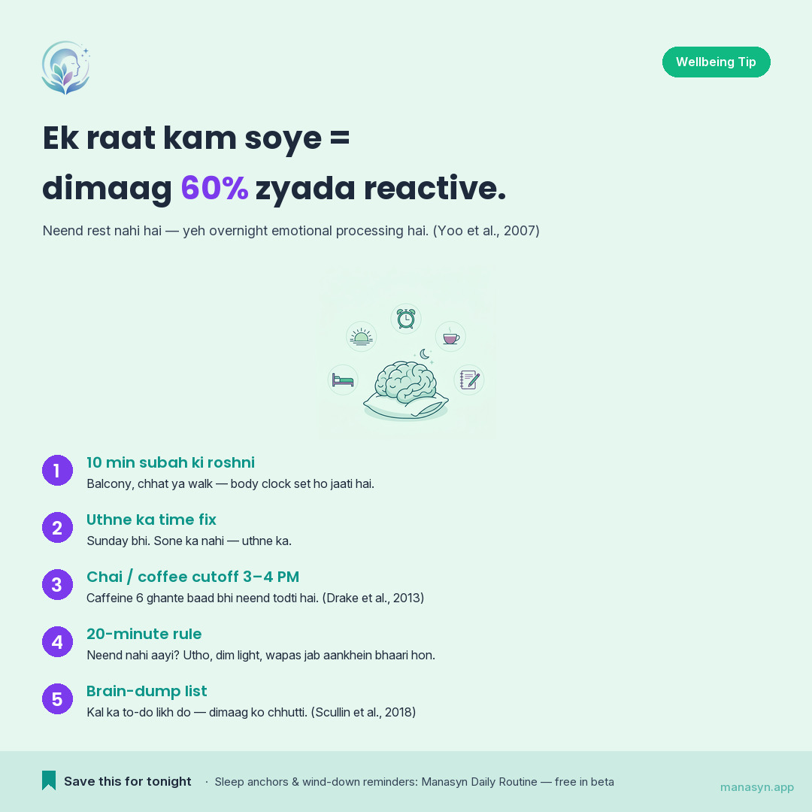

**Tweet 1** — attach `post2/post2-square-1080x1080.jpg` (184 chars)

```text
1/ One bad night of sleep and suddenly everything feels personal?

That's not your personality. It's your amygdala.

A thread on why sleep is the cheapest mental-health tool you own 🧠
```

**Tweet 2** (251 chars)

```text
2/ In a brain-imaging study, ONE night without sleep made the amygdala (the emotion centre) over 60% more reactive to negative images — while the prefrontal cortex, which normally calms it, disconnected (Yoo et al., 2007).

Brakes off. Accelerator on.
```

**Tweet 3** (225 chars)

```text
3/ It works the other way too.

A meta-analysis of 65 randomised trials found that improving sleep improves depression, anxiety, rumination AND stress (Scott et al., 2021).

Sleep isn't a self-care bonus. It's the foundation.
```

**Tweet 4** (206 chars)

```text
4/ Myth: "I've adapted to 5–6 hours."

Reality: after 2 weeks at 6 hrs/night, people FELT fine while their performance kept dropping every day (Van Dongen et al., 2003).

You don't adapt. You stop noticing.
```

**Tweet 5** (272 chars)

```text
5/ Five anchors that work tonight:
☀️ 10 min morning light
⏰ Fixed WAKE time, even Sunday
🍵 Chai/coffee cutoff 3–4 PM (Drake et al., 2013)
🛏 Not asleep in 20 min → get up, dim light, return when sleepy
📝 Write tomorrow's to-do list before bed (Scullin et al., 2018)
```

**Tweet 6** (212 chars)

```text
6/ Pick one. Not five — one.

If sleep has been broken for 3+ weeks, see a doctor. India: Tele-MANAS 14416 · iCall 9152987821 (Mon–Sat 10–8) · Emergency 112

Follow @Manasynapp for more 🧠 #MentalHealth #MindCare
```

**Alt text:** Infographic: a brain resting on a pillow with five sleep-habit icons on mint — Manasyn sleep and mental health tips.

**How:** One tweet per box below, each as a reply to the previous one (a thread). Add alt text on the image (*+ALT*).

---
## 1:00 PM · Pinterest · Post 2

**Wellbeing Wisdom — Sleep** — *1:00 PM · 2:3 pin · Boards: Mental Health Tips / Wellness / Self Care India*

**Attach:**

- `post2/post2-pinterest-1000x1500.jpg` — destination link: https://manasyn.app

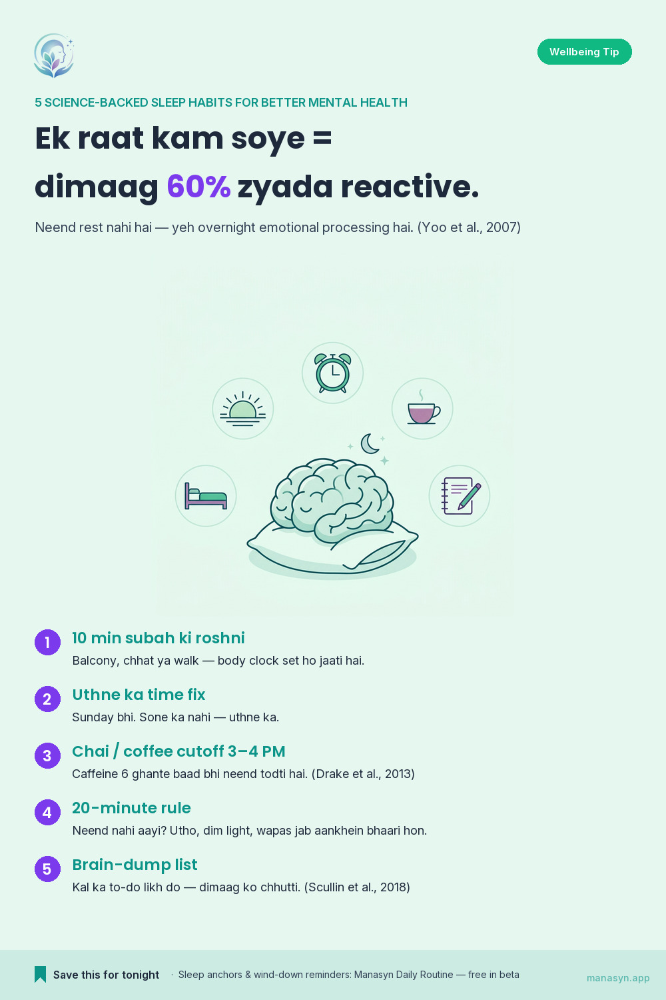

**Caption:**

```text
Title: 5 Science-Backed Sleep Habits for Better Mental Health (Why One Bad Night Makes You 60% More Reactive)

Description:
Struggling with mood swings, anxiety or irritability? Check your sleep first. Research shows one night of poor sleep makes the brain's emotion centre over 60% more reactive (Yoo et al., 2007), and improving sleep improves depression, anxiety and stress (Scott et al., 2021). Save these 5 sleep hygiene tips for better mental health tonight: 1) Get 10 minutes of morning sunlight. 2) Fix your wake-up time — even on weekends. 3) Stop caffeine (chai, coffee, cola) by 3–4 PM. 4) Use the 20-minute rule: can't sleep, get up until drowsy. 5) Write tomorrow's to-do list before bed. Simple sleep routine ideas for students, professionals and night owls in India. From Manasyn — self-guided mental wellness tools in English, Hindi, Maithili and Bhojpuri, free in beta at manasyn.app. Not medical advice.

#SleepTips #SleepHygiene #BetterSleep #MentalHealthTips #SelfCareIndia #WellnessTips #AnxietyRelief #StressManagement #HealthyHabits #SleepRoutine #MentalWellness #BrainHealth #SelfCareRoutine #Manasyn
```

**Alt text:** Mint-green infographic of a cartoon brain sleeping on a pillow under a crescent moon, ringed by icons for sunrise, alarm clock, chai cup, bed and notebook. Headline: one night of poor sleep makes the brain 60% more reactive. Manasyn wellbeing tip.

**How:** Title = the *Title:* line, description = the rest, set the destination link, pick the board named in the header.

---
## 1:00 PM · LinkedIn (optional) · Post 2

**Wellbeing Wisdom — Sleep** — *optional 1:00 PM · professional English*

**Attach:**

- `post2/post2-portrait-1080x1350.jpg`


**Caption:**

```text
The cheapest productivity tool in your company is not a software licence. It's sleep — and most of us are underinvesting in it while calling it discipline.

Here is what the research actually says.

One night of sleep deprivation makes the amygdala — the brain's threat and emotion centre — over 60% more reactive to negative stimuli, while its connection to the prefrontal cortex, the region responsible for context and self-control, weakens (Yoo et al., 2007). In practical terms: the colleague who "overreacted" in the 9 AM meeting may simply have slept four hours.

The effect is bidirectional. A 2021 meta-analysis of 65 randomised controlled trials found that improving sleep produced medium-sized improvements in depression, anxiety, rumination and stress — and the more sleep improved, the more mental health improved (Scott et al., 2021). Sleep is not downstream of mental health; it is one of its levers.

The "I've adapted to five hours" belief doesn't survive contact with the lab. When participants were restricted to six hours a night for two weeks, their subjective sleepiness plateaued after a few days — but their cognitive performance kept declining, ending up comparable to people kept awake for two full nights (Van Dongen et al., 2003). We don't adapt. We lose the ability to notice.

For adults, the consensus recommendation is seven or more hours per night (Watson et al., 2015).

Five evidence-based anchors that cost nothing:
1. Ten minutes of outdoor light within an hour of waking.
2. A fixed wake time — including weekends. Circadian rhythm is set by when you get up, not when you lie down.
3. Caffeine cutoff eight hours before bed; even six hours out, it measurably fragments sleep (Drake et al., 2013).
4. Stimulus control: not asleep within ~20 minutes → leave the bed, dim light, return when drowsy.
5. A five-minute to-do list before bed — writing tomorrow's tasks shortened sleep onset in a polysomnography study (Scullin et al., 2018).

For leaders: the fastest wellbeing intervention you can run is not a webinar. It's protecting the last hour of your team's evening from "quick" messages.

We built sleep anchors and wind-down reminders into Manasyn's Daily Routine for exactly this reason — small structure, no guilt-trip streaks. Free during private beta.
Visit manasyn.app | Building mental healthcare for India 💚

Which of the five would be hardest for you to keep for two weeks — and why?

#SleepHealth #MentalHealthIndia #WorkplaceWellbeing #Productivity #Neuroscience #EmployeeWellbeing #Manasyn
```

**Alt text:** Mint-green infographic of a cartoon brain sleeping on a pillow under a crescent moon, ringed by icons for sunrise, alarm clock, chai cup, bed and notebook. Headline: one night of poor sleep makes the brain 60% more reactive. Manasyn wellbeing tip.

**How:** Post from the **Manasyn company page** (linkedin.com/company/manasyn), not a personal profile. Alt text: click the image → *Add alt text*.

---
## 1:15 PM · Threads · Post 2

**Wellbeing Wisdom — Sleep** — *1:15 PM · casual Hinglish*

**Attach:**

- `post2/post2-square-1080x1080.jpg`


**Caption:**

```text
PSA: kal raat 4 ghante soye ho toh aaj jo bhi "bahut bada issue" lag raha hai, usse kal subah dobara dekhna 😴

ek raat ki kam neend se amygdala (emotion centre) 60%+ zyada reactive ho jaata hai aur uske brakes (prefrontal cortex) dheele pad jaate hain (Yoo et al., 2007) 🧠

matlab dimaag pe accelerator hai, brake nahi.

aaj raat ke liye 3 chhote anchors:
☀️ subah 10 min roshni
🍵 chai cutoff 4 PM
📝 sone se pehle kal ki list likh do

save karo, aur us dost ko bhejo jo "bas ek aur episode" bolta hai 🔖

@manasynapp ke Daily Routine mein sleep anchors built-in hain — free in beta 💚

aapka sabse bada neend-chor kya hai? 👇

#SleepHealth #MentalHealthIndia #WellbeingTips #Manasyn
```

**Alt text:** Infographic: a brain resting on a pillow with five sleep-habit icons on mint — Manasyn sleep and mental health tips.

**How:** Casual tone is intentional (lower-case Hinglish). Same image as X.

---
## 1:30 PM · Facebook · Post 2

**Wellbeing Wisdom — Sleep** — *1:30 PM · simple Hindi + English*

**Attach:**

- `post2/post2-square-1080x1080.jpg`


**Caption:**

```text
Aaj subah uthte hi mood kharab tha? Chhoti si baat pe gussa aa gaya? Pehle apne aap se ek sawaal poochiye — kal raat kitne ghante soye the? 🌙

Hum neend ko "aaram" samajhte hain. Science kuch aur kehti hai: neend woh time hai jab dimaag din bhar ki emotions ko process karta hai aur unka "volume" kam karta hai.

Ek famous brain-scan study mein logon ko ek raat jagaya gaya. Agle din unka emotion centre (amygdala) negative tasveeron pe 60% se zyada react kar raha tha, aur use shaant rakhne wala prefrontal cortex theek se connect nahi ho raha tha (Yoo et al., 2007). Isiliye kam neend ke baad sab kuch "zyada" lagta hai — zyada bura, zyada personal.

Achhi khabar: yeh raasta dono taraf chalta hai. Jab neend sudharti hai, mood, anxiety aur stress bhi sudharte hain — 65 studies ke ek bade review ne yahi paaya (Scott et al., 2021).

Ek aam galatfehmi: "Main 5 ghante ka aadi hoon." Research mein log 2 hafte roz 6 ghante soye — unhe neend "theek" lagne lagi, lekin concentration roz girti rahi (Van Dongen et al., 2003). Hum adapt nahi karte, bas pata chalna band ho jaata hai. Adults ke liye 7+ ghante recommended hain (American Academy of Sleep Medicine, 2015).

5 chhote anchors jo aaj raat se shuru kar sakte hain:
1. Subah 10 minute ki dhoop — balcony ya chhat kaafi hai.
2. Uthne ka time fix rakhiye — Sunday ko bhi. Body clock sone se nahi, uthne se set hoti hai.
3. Shaam 4 baje ke baad chai-coffee nahi. Caffeine 6 ghante baad bhi neend ko todti hai (Drake et al., 2013).
4. Bistar pe 20 minute mein neend nahi aayi? Uthiye, halki roshni mein kuch boring kijiye, wapas tab aaiye jab aankhein bhaari hon.
5. Sone se pehle kal ke kaamon ki list likh dijiye — dimaag ko "yaad rakhne" ki duty se chhutti mil jaati hai (Scullin et al., 2018). 📝

Manasyn ke Daily Routine mein sleep anchor aur wind-down reminders built-in hain — private beta mein free. 💚
👉 manasyn.app

Poll 👇 Aapka sabse bada neend-chor kaun hai?
A) Phone   B) Chai/coffee   C) Overthinking   D) "Bas ek aur episode"

Yeh general wellbeing tips hain, medical advice nahi. Agar 3 hafte se zyada neend kharab hai, toh doctor se zaroor milen.
🆘 Emergency: 112 · Tele-MANAS: 14416 (24×7) · iCall: 9152987821 (Mon–Sat, 10 AM–8 PM)

#SleepHealth #MentalHealthIndia #WellbeingTips #SelfCare #Manasyn
```

**Alt text:** Mint-green infographic of a cartoon brain sleeping on a pillow under a crescent moon, ringed by icons for sunrise, alarm clock, chai cup, bed and notebook. Headline: one night of poor sleep makes the brain 60% more reactive. Manasyn wellbeing tip.

**How:** Normal photo post. Where the caption ends with a poll / fill-in-the-blank, add it in the composer (Poll) or just leave it in the text — both work.

---
## 2:00 PM · Reddit · Post 2

**Wellbeing Wisdom — Sleep** — *2:00 PM · r/india or r/mentalhealth or r/IndianPsychology · Flair: Educational / Resource · **check sub rules; image post optional***

**Attach:**

- `post2/post2-square-1080x1080.jpg` — optional — only if the sub allows images; the text is the post


**Caption:**

```text
Title: One night of bad sleep makes your brain's emotion centre ~60% more reactive — five evidence-based sleep habits that actually work (with sources)

Body:
I went down a research rabbit hole after noticing I turn into a completely different, angrier person after a 4-hour night. Turns out there's a clean explanation.

Why bad sleep = short fuse. In a brain-imaging study, a single night without sleep made the amygdala (emotion/threat centre) more than 60% more reactive to negative images, while its connection to the prefrontal cortex — the part that provides context and puts the brakes on — weakened (Yoo et al., 2007, Current Biology). Everything feels bigger and more personal because, neurologically, it is.

It's a lever, not just a symptom. A 2021 meta-analysis of 65 RCTs found that improving sleep improved depression, anxiety, rumination and stress — with a dose-response relationship (Scott et al., 2021, Sleep Medicine Reviews).

The "I've adapted" myth. People restricted to 6 hours/night for two weeks felt fine after a few days, but their performance kept dropping to the level of people kept awake for two full nights (Van Dongen et al., 2003, Sleep). You don't adapt; you stop noticing.

Five things that hold up in studies (and cost nothing):
1. ~10 minutes of outdoor light soon after waking.
2. Fixed wake time, weekends included — the body clock is set by when you get up.
3. Caffeine cutoff ~8 hours before bed. Even 6 hours before, it measurably fragments sleep (Drake et al., 2013). Yes, the 6 PM chai counts.
4. Stimulus control: not asleep in ~20 minutes → get out of bed, dim light, boring task, return when drowsy. Bed = sleep only.
5. Write tomorrow's to-do list before bed. In a polysomnography study, people who did this fell asleep ~9 minutes faster than those who journaled completed tasks (Scullin et al., 2018).

Not medical advice — if sleep has been wrecked for 3+ weeks, see a doctor; insomnia has real treatments (CBT-I).

Disclosure: I put this together for Manasyn, a mental-health app I work on — this post isn't about the app, just the notes. I made this with Manasyn — thoughts? Would love to hear what actually worked for people here, especially with Indian schedules (late dinners, night shifts, hostel life).
```

**How:** Text post first, image/gallery only if the sub allows. Read the sub's self-promotion rule first; keep the disclosure at the end; reply to comments, don't link-drop.

---
## 7:00 PM · Instagram · Post 3

**Psych Notes — Freud's Psychoanalysis (8-slide carousel)** — *7:00 PM · Hinglish · hashtags in FIRST COMMENT*

**Attach:**

- `post3/post3-slide-01.jpg` — slide 1
- `post3/post3-slide-02.jpg` — slide 2
- `post3/post3-slide-03.jpg` — slide 3
- `post3/post3-slide-04.jpg` — slide 4
- `post3/post3-slide-05.jpg` — slide 5
- `post3/post3-slide-06.jpg` — slide 6
- `post3/post3-slide-07.jpg` — slide 7
- `post3/post3-slide-08.jpg` — slide 8
- `post3/post3-story-1080x1920.jpg` — Story after publishing — link sticker → manasyn.app/courses

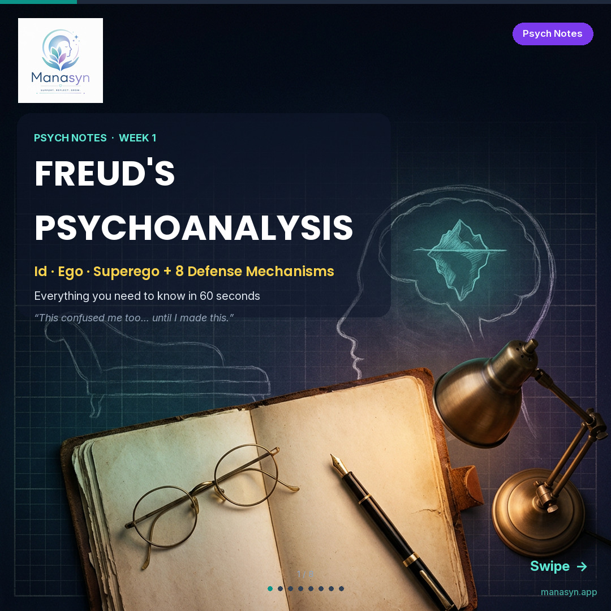 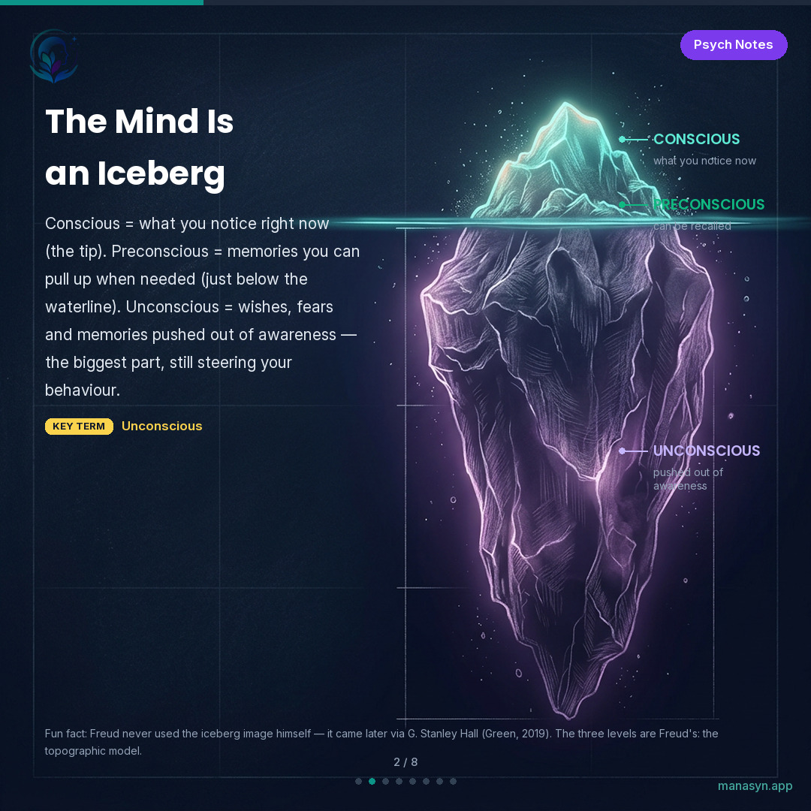 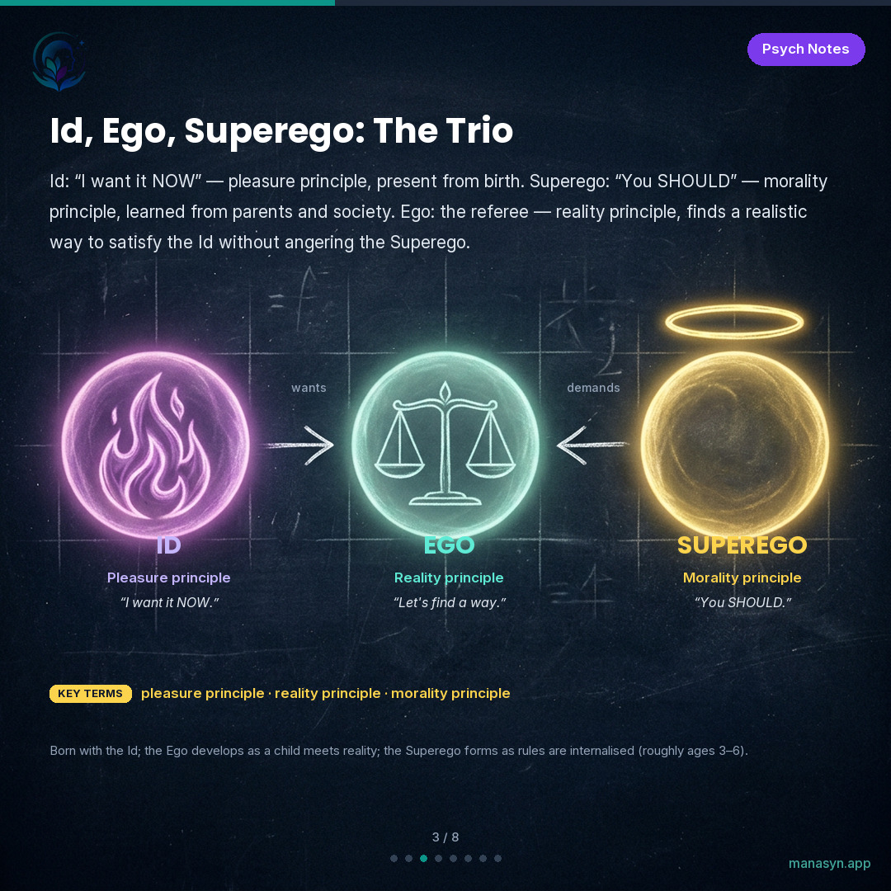 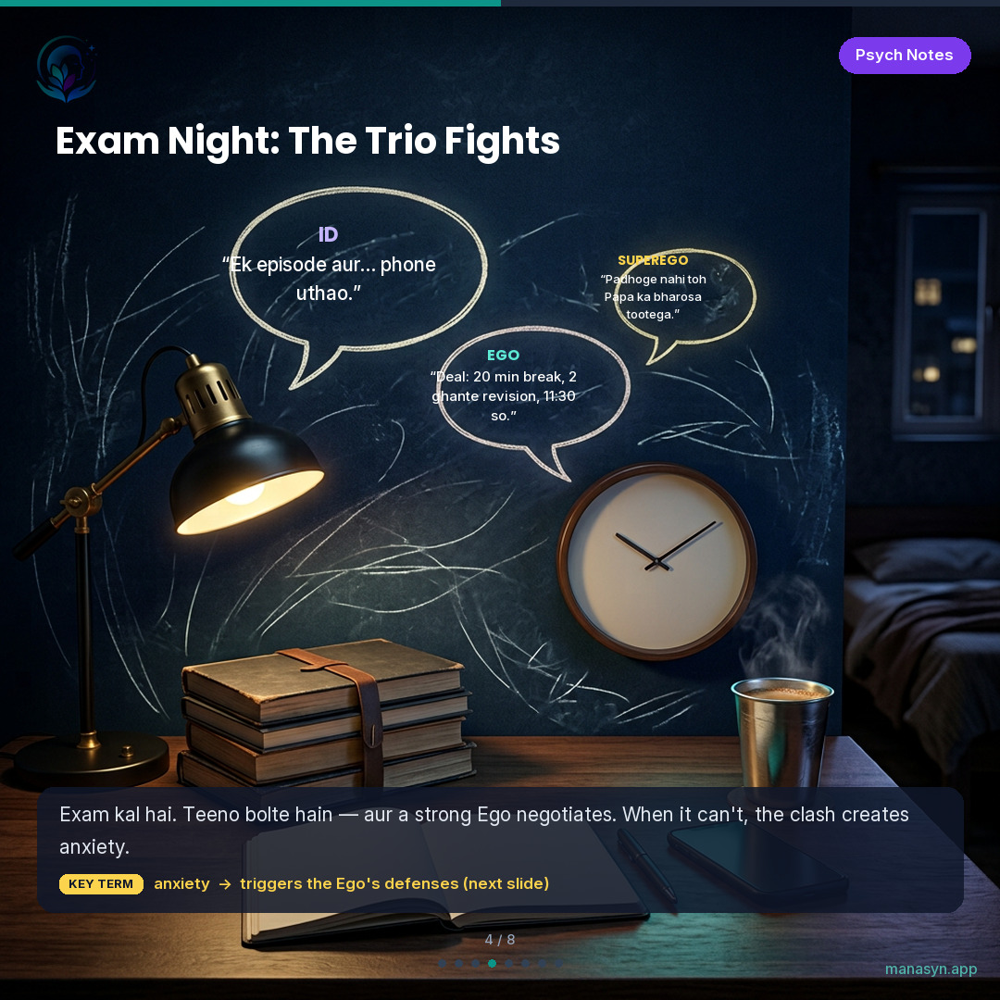 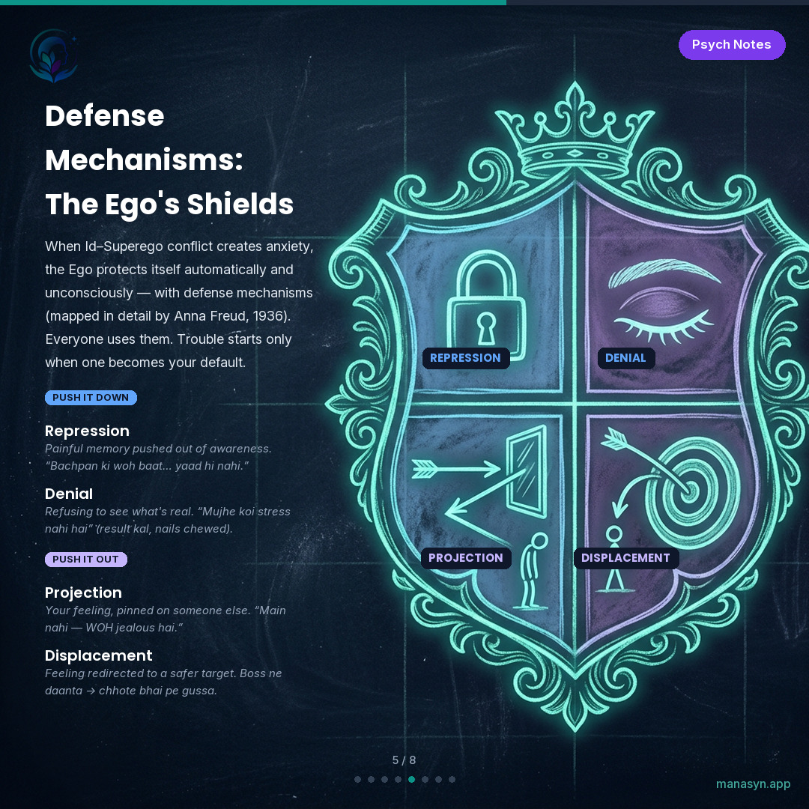 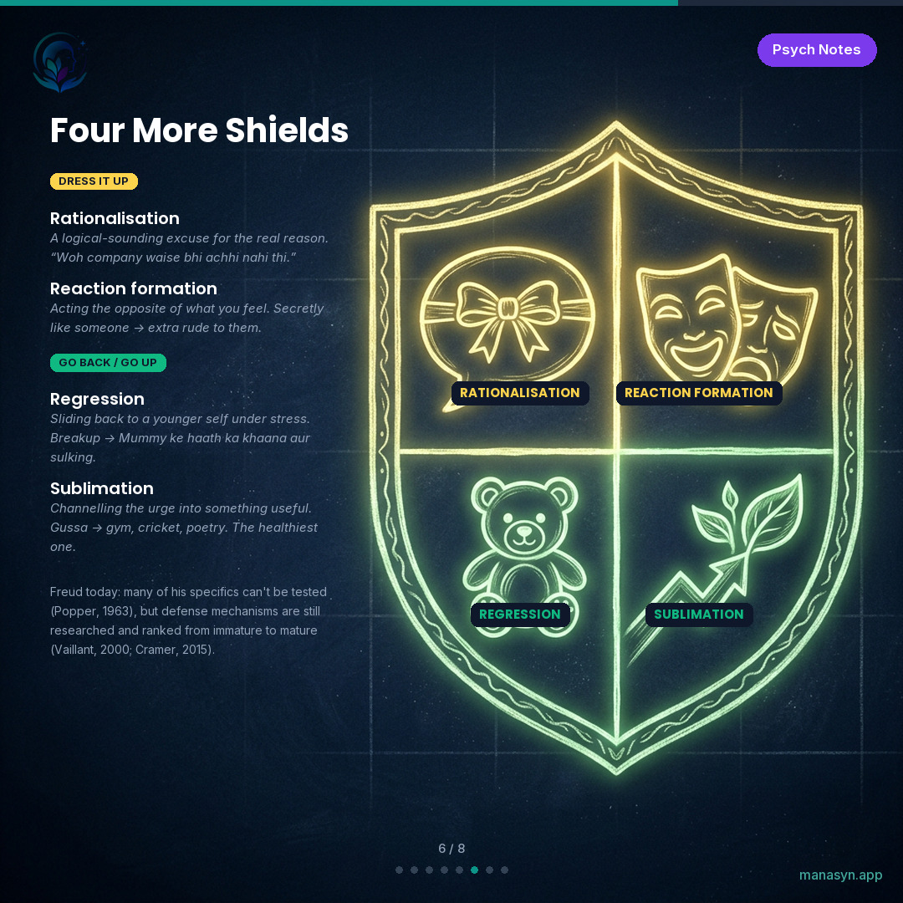 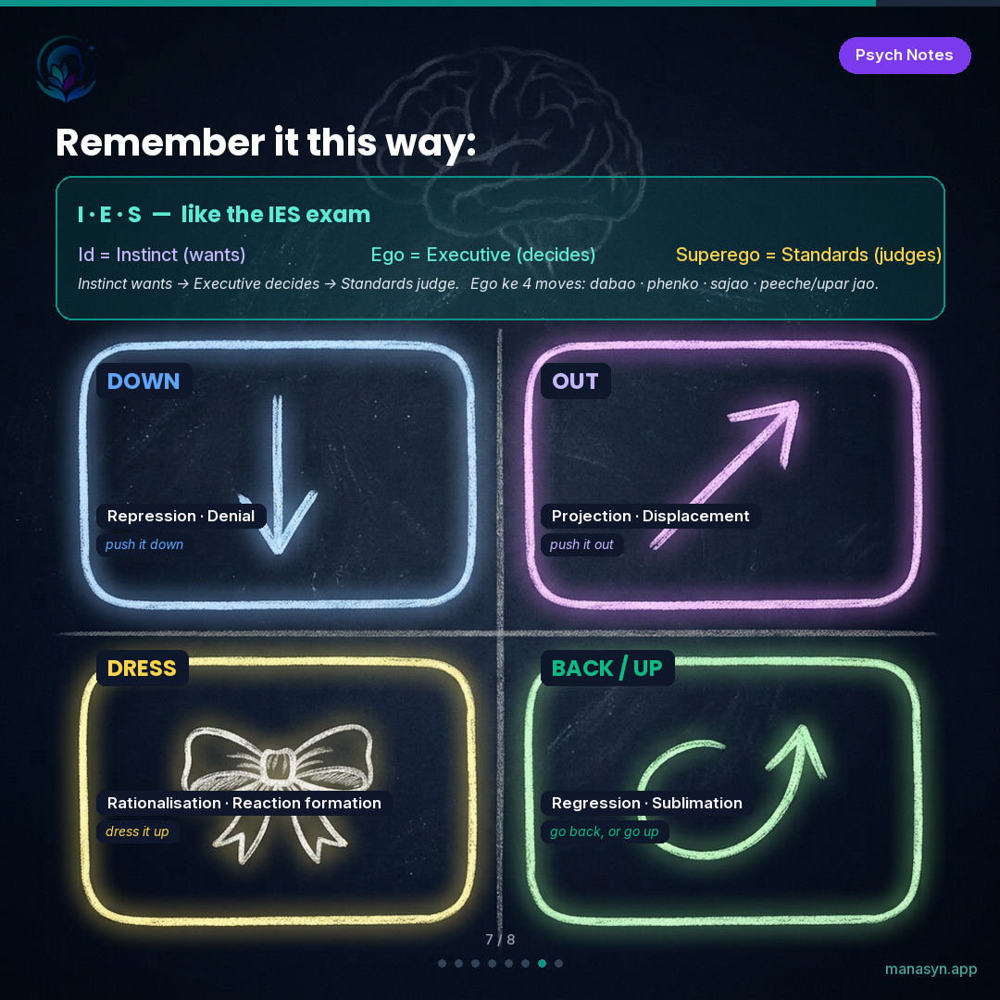 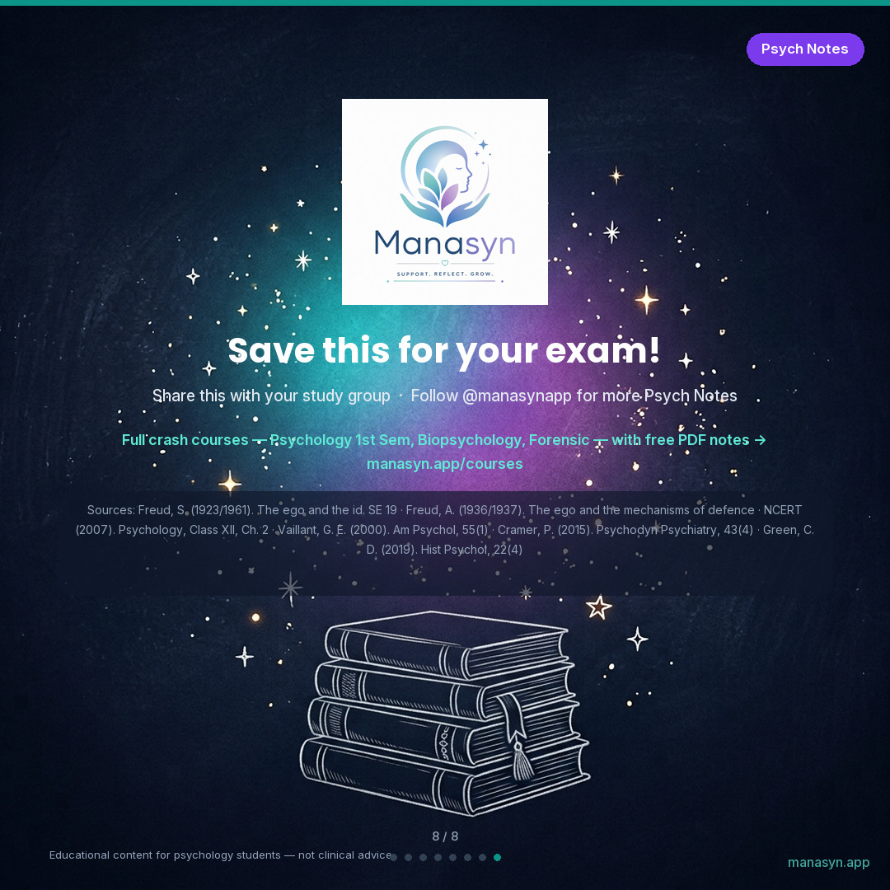 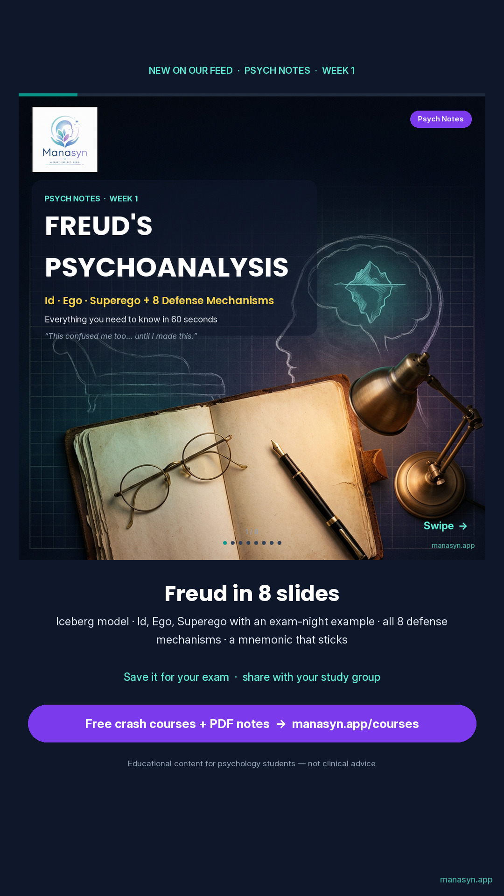

**Caption:**

```text
Id, Ego, Superego — teen naam toh yaad ho jaate hain. Matlab nahi. 🧠

Mujhe bhi confuse karta tha… jab tak maine yeh notes nahi banaye. Swipe karo →

Freud ne mind ko teen layers mein baanta: jo abhi dikh raha hai (conscious), jo yaad kar sakte ho (preconscious), aur woh bada hissa jo paani ke neeche hai — wishes, fears, memories jo bahar dhakel di gayin, lekin gaadi wahi chala rahi hain (unconscious). 🧊

Phir teen players:
• Id — "abhi chahiye." (pleasure principle)
• Superego — "sharam karo." (morality principle)
• Ego — "chalo deal karte hain." (reality principle)

Exam ki raat yeh teeno aapke andar ladte hain — slide 4 mein poora scene hai. 😄

Jab Ego deal nahi kara paata, anxiety aati hai. Aur tab Ego apni 8 dhaalein nikalta hai — defense mechanisms. Repression se Sublimation tak, har ek ka ek desi example slides 5–6 mein.

Aur slide 7 pe woh trick jo exam hall mein kaam aayegi:
I·E·S = Instinct, Executive, Standards.
Defenses = DOWN · OUT · DRESS · BACK/UP. 📝

Save this for your exam 📚 aur apne study group mein share karo 💜

Poora Psychology 1st Sem crash course — personality, learning, memory, Maslow — free PDF notes ke saath manasyn.app/courses pe hai (link in bio).

Honest sawaal: aap sabse zyada kaunsa defense mechanism use karte ho? 👇 (Mera: rationalisation. Roz. 🙈)

📚 Sources: Freud, 1923 | A. Freud, 1936 | NCERT Class XII | Vaillant, 2000 | Cramer, 2015 | Green, 2019 | Full refs in bio link
```

**First comment (hashtags — Set A):**

```text
#manasyn #manasynapp #mindcareai #PsychNotes #PsychologyStudent #PsychologyIndia #Freud #Psychoanalysis #IdEgoSuperego #DefenseMechanisms #PsychologyNotes #StudyGram #StudyGramIndia #PsychologyFacts #StudyNotes #ExamPrep #Class12Psychology #BAPsychology #MAPsychology #UGCNETPsychology #NCERTPsychology #PsychologyMajor #PsychologyLovers #StudentLife #LearnPsychology
```

**Alt text:** Dark academic carousel: Freud's iceberg, Id-Ego-Superego orbs and 8 defense mechanism shields — Manasyn Psych Notes.

Per-slide alt text (optional, one per image):

1. Cover: Freud's Psychoanalysis — vintage study with notebook, spectacles and lamp. Manasyn Psych Notes, Week 1.
2. Iceberg diagram: conscious tip, preconscious at the waterline, unconscious mass below — Freud's topographic model.
3. Three glowing orbs labelled Id (pleasure principle), Ego (reality principle) and Superego (morality principle).
4. Exam-night desk with three speech bubbles: Id, Ego and Superego arguing about one more episode versus revision.
5. Chalk shield with four defense mechanisms — repression, denial, projection, displacement — each with an example.
6. Second shield: rationalisation, reaction formation, regression, sublimation — each with an everyday example.
7. Mnemonic slide: I·E·S = Instinct, Executive, Standards; four boxes labelled DOWN, OUT, DRESS and BACK/UP.
8. Manasyn logo with Save this for your exam, a link to free courses at manasyn.app/courses and the APA sources.

**How:** Paste the caption → publish → immediately paste the hashtag block as your own **first comment**. Alt text: *Advanced settings → Write alt text*. Then post the Story and add the link sticker.

---
## 7:00 PM · X · Post 3

**Psych Notes — Freud's Psychoanalysis (8-slide carousel)** — *7:00 PM · thread, 7 tweets · attach slides 1–7 as images, one per tweet*

**Attach:**

- `post3/post3-slide-01.jpg` — tweet 1
- `post3/post3-slide-02.jpg` — tweet 2
- `post3/post3-slide-03.jpg` — tweet 3
- `post3/post3-slide-04.jpg` — tweet 4
- `post3/post3-slide-05.jpg` — tweet 5
- `post3/post3-slide-06.jpg` — tweet 6
- `post3/post3-slide-07.jpg` — tweet 7

      

**Tweet 1** — attach `post3/post3-slide-01.jpg` (164 chars)

```text
1/ Id, Ego, Superego: everyone memorises the names, nobody remembers what they do.

Freud's whole model in 6 tweets, with the mnemonic that finally made it stick 🧠
```

**Tweet 2** — attach `post3/post3-slide-02.jpg` (271 chars)

```text
2/ The mind is an iceberg.
Tip = conscious (what you notice now)
Waterline = preconscious (what you can recall)
Underwater = unconscious (wishes, fears, memories pushed out of view — still steering you)

Fun fact: Freud never used the iceberg image himself (Green, 2019).
```

**Tweet 3** — attach `post3/post3-slide-03.jpg` (217 chars)

```text
3/ Three players:
Id → "I want it NOW" (pleasure principle, born with it)
Superego → "You SHOULD" (morality; parents + society)
Ego → the referee (reality principle) — satisfies the Id without angering the Superego
```

**Tweet 4** — attach `post3/post3-slide-04.jpg` (188 chars)

```text
4/ Exam night:
Id: "one more episode"
Superego: "you'll disappoint everyone"
Ego: "20-min break, then 2 hours, sleep by 11:30"

A strong Ego negotiates. When it can't, the clash = anxiety.
```

**Tweet 5** — attach `post3/post3-slide-05.jpg` (276 chars)

```text
5/ Anxiety triggers the Ego's shields — defense mechanisms (Anna Freud, 1936):
🔒 Repression — memory pushed out of awareness
🙈 Denial — "I'm not stressed" (nails bitten raw)
🪞 Projection — "I'm not jealous, THEY are"
↪ Displacement — boss yells → you snap at your sibling
```

**Tweet 6** — attach `post3/post3-slide-06.jpg` (246 chars)

```text
6/ Four more:
🎀 Rationalisation — "that company was bad anyway"
🎭 Reaction formation — like someone → act rude to them
🧸 Regression — stress → childlike sulking
🌱 Sublimation — anger → gym, cricket, poetry (the healthy one; Vaillant, 2000)
```

**Tweet 7** — attach `post3/post3-slide-07.jpg` (271 chars)

```text
7/ The mnemonic:
I·E·S = Instinct (Id), Executive (Ego), Standards (Superego)
Defenses = DOWN (repress, deny) · OUT (project, displace) · DRESS (rationalise, react) · BACK/UP (regress, sublimate)

Save for your exam. Follow @Manasynapp for more 🧠 #Psychology #PsychNotes
```

**Alt text:** Dark academic carousel: Freud's iceberg, Id-Ego-Superego orbs and 8 defense mechanism shields — Manasyn Psych Notes.

**How:** One tweet per box below, each as a reply to the previous one (a thread). Add alt text on the image (*+ALT*).

---
## 7:00 PM · LinkedIn · Post 3

**Psych Notes — Freud's Psychoanalysis (8-slide carousel)** — *7:00 PM · professional English · post as PDF document carousel*

**Attach:**

- `post3/post3-carousel-linkedin.pdf` — upload as a Document post (this is what makes it swipeable)

**Caption:**

```text
Most psychology graduates can recite "Id, Ego, Superego." Far fewer can use the model — and that gap matters more than it seems.

Freud's structural model (1923) is over a century old, and parts of it have not survived scientific scrutiny: several of its claims are not falsifiable in the way Popper (1963) demanded of a theory. Students should know that. But dismissing the whole framework throws away one of the most clinically useful ideas in the field: that people protect themselves from anxiety in patterned, largely automatic ways.

Defense mechanisms did not stay frozen in 1936. Anna Freud catalogued them; George Vaillant then spent decades tracking them in longitudinal cohorts and showed that "mature" defenses — sublimation, humour, anticipation, altruism — predict better mental health and life outcomes over time, while "immature" ones such as projection and acting out predict the opposite (Vaillant, 2000). Contemporary reviews treat defenses as measurable processes with developmental trajectories, not literary metaphors (Cramer, 2015). And meta-analytic work finds psychodynamic therapy produces effect sizes comparable to other evidence-based treatments (Shedler, 2010).

Why this matters for anyone who works with people — clinicians, educators, managers:

• Displacement explains the colleague who is impeccably polite to the client and sharp with the intern.
• Rationalisation is the polished reason offered after the decision was already made.
• Reaction formation is the excessive enthusiasm that protects against an admission of doubt.
• Sublimation is what good mentorship tries to cultivate: the same energy, pointed somewhere useful.

Recognising the pattern is not diagnosing anyone. It is the difference between reacting to behaviour and understanding it.

For psychology students in India preparing for semester exams, UGC-NET or entrance tests: learn the model precisely (pleasure, reality and morality principles), learn the eight classic defenses with one everyday example each, and learn the criticism alongside — examiners reward both. The carousel attached does exactly that in eight slides, with a mnemonic that holds up under exam pressure.

We built Manasyn's student side — visual crash courses with free PDF notes, and an AI counselling simulator with virtual clients — for exactly this kind of learning. Educational only; not accreditation or a licence to practise.

Visit manasyn.app | Building mental healthcare for India 💚

Practitioners: which defense mechanism do you find yourself naming most often in formulation — and which one do you suspect you use most yourself?

#Psychology #PsychologyStudents #ClinicalPsychology #MentalHealthIndia #Psychoanalysis #HigherEducation #Manasyn
```

**Alt text:** Eight-slide Manasyn Psych Notes carousel on Freud's psychoanalysis: an iceberg diagram of the unconscious, three coloured orbs for Id, Ego and Superego, an exam-night example, two shields showing 8 defense mechanisms, a mnemonic and sources.

**How:** Post from the **Manasyn company page** (linkedin.com/company/manasyn), not a personal profile. Alt text: click the image → *Add alt text*.

---
## 7:15 PM · Threads · Post 3

**Psych Notes — Freud's Psychoanalysis (8-slide carousel)** — *7:15 PM · casual Hinglish*

**Attach:**

- `post3/post3-slide-01.jpg` — cover (or add all 8 as a carousel)


**Caption:**

```text
Freud ka poora funda 30 sec mein 🧠

Id = "abhi chahiye" 😈
Superego = "sharam karo" 😇
Ego = "chalo deal karte hain" 🤝

exam ki raat teeno ladte hain. jab Ego deal nahi kara paata → anxiety. aur tab Ego apni 8 dhaalein nikaalta hai (defense mechanisms) — boss ka gussa bhai pe nikaalna, "woh company waise bhi bekaar thi", etc.

yaad rakhne ki trick: I·E·S = Instinct, Executive, Standards.
defenses: DOWN · OUT · DRESS · BACK/UP 📝

poora 8-slide carousel @manasynapp pe hai — save karo, study group mein bhejo 💜

honest: aapka go-to defense mechanism kaunsa hai? mera rationalisation 🙈👇

#PsychNotes #Freud #PsychologyStudent #Manasyn
```

**Alt text:** Dark academic carousel: Freud's iceberg, Id-Ego-Superego orbs and 8 defense mechanism shields — Manasyn Psych Notes.

**How:** Casual tone is intentional (lower-case Hinglish). Same image as X.

---
## 7:30 PM · Facebook · Post 3

**Psych Notes — Freud's Psychoanalysis (8-slide carousel)** — *7:30 PM · simple Hindi + English*

**Attach:**

- `post3/post3-slide-01.jpg` — photo 1
- `post3/post3-slide-02.jpg` — photo 2
- `post3/post3-slide-03.jpg` — photo 3
- `post3/post3-slide-04.jpg` — photo 4
- `post3/post3-slide-05.jpg` — photo 5
- `post3/post3-slide-06.jpg` — photo 6
- `post3/post3-slide-07.jpg` — photo 7
- `post3/post3-slide-08.jpg` — photo 8

       

**Caption:**

```text
Class 12 ya BA first year mein jab pehli baar Freud padha tha, toh ek hi cheez samajh aayi thi — "Id, Ego, Superego" — aur exam mein teeno ko mix kar diya tha. 🙈

Agar aapke saath bhi aisa hua hai, toh yeh 8 slides aapke liye hain. Swipe kijiye →

Freud ke hisaab se hamara mann ek iceberg jaisa hai. Upar ka chhota hissa — jo abhi soch rahe hain (conscious). Paani ki line ke paas — jo yaad kar sakte hain (preconscious). Aur neeche ka bada hissa — woh ichchhaayein, darr aur yaadein jo humne bahar dhakel di, lekin jo aaj bhi hamare faislon ko chala rahi hain (unconscious). 🧊

Phir personality ke teen hisse:
Id — bachpan se hai. "Abhi chahiye." (Pleasure principle)
Superego — parents aur samaaj se seekha. "Yeh galat hai, sharam karo." (Morality principle)
Ego — beech ka referee. "Chalo, koi practical raasta nikaalte hain." (Reality principle)

Exam ki raat wala scene sochiye: Id kehta hai "ek episode aur", Superego kehta hai "Papa ka bharosa tootega", aur Ego deal karata hai — "20 minute break, phir 2 ghante padhai." Jab Ego deal nahi kara paata, tab anxiety aati hai.

Aur anxiety se bachne ke liye Ego 8 tarah ki dhaalein (defense mechanisms) use karta hai — jaise boss ka gussa chhote bhai pe nikaalna (displacement), ya "woh company waise bhi achhi nahi thi" (rationalisation). Sab 8 examples ke saath slides 5–6 mein hain, aur slide 7 pe yaad rakhne ki trick.

Ek zaroori baat: Freud ki kai baatein aaj science mein test nahi hoti, lekin defense mechanisms par research aaj bhi ho rahi hai (Vaillant, 2000; Cramer, 2015). Isliye theory bhi padhiye, criticism bhi.

Poora Psychology 1st Semester crash course — free PDF notes ke saath — manasyn.app/courses par hai. 📚
👉 manasyn.app

Poll 👇 Exam ki raat aapke andar kaun jeetta hai?
A) Id ("ek episode aur")   B) Superego ("guilt trip")   C) Ego ("deal karo")

Share this with your study group 💜

#PsychNotes #PsychologyStudent #Freud #PsychologyIndia #Manasyn
```

**Alt text:** Eight-slide Manasyn Psych Notes carousel on Freud's psychoanalysis: an iceberg diagram of the unconscious, three coloured orbs for Id, Ego and Superego, an exam-night example, two shields showing 8 defense mechanisms, a mnemonic and sources.

**How:** Normal photo post. Where the caption ends with a poll / fill-in-the-blank, add it in the composer (Poll) or just leave it in the text — both work.

---
## 7:30 PM · Pinterest · Post 3

**Psych Notes — Freud's Psychoanalysis (8-slide carousel)** — *7:30 PM · 2:3 pin · Boards: Psychology Notes / Psychology Student / Study Notes*

**Attach:**

- `post3/post3-pinterest-1000x1500.jpg` — destination link: https://manasyn.app/courses

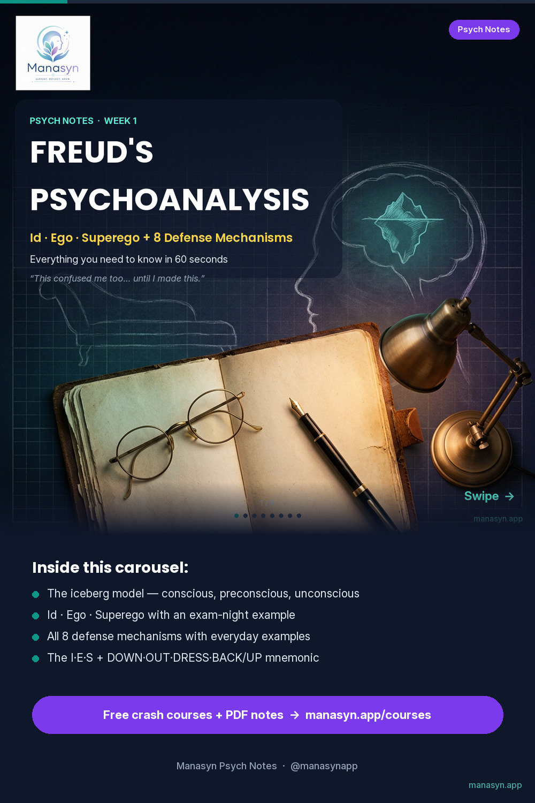

**Caption:**

```text
Title: Freud's Id, Ego & Superego Explained + 8 Defense Mechanisms With Examples | Psychology Notes

Description:
Struggling to remember Freud's psychoanalytic theory for your psychology exam? These visual psych notes break it down in 60 seconds: the iceberg model of the mind (conscious, preconscious, unconscious), the three parts of personality — Id (pleasure principle), Ego (reality principle) and Superego (morality principle) — with an easy exam-night example, and all 8 classic defense mechanisms with everyday examples: repression, denial, projection, displacement, rationalisation, reaction formation, regression and sublimation. Includes the I·E·S mnemonic and the DOWN-OUT-DRESS-BACK/UP memory trick, plus what modern research says (Vaillant, 2000; Cramer, 2015). Perfect for Class 12, BA/MA psychology, UGC-NET and CUET revision. Save this pin for your study notes. Full visual crash courses with free PDF notes at manasyn.app/courses — from Manasyn Psych Notes.

#PsychologyNotes #Freud #IdEgoSuperego #DefenseMechanisms #PsychologyStudent #StudyNotes #Psychoanalysis #PsychologyFacts #ExamRevision #StudyTips #PsychologyMajor #Class12Psychology #UGCNET #LearnPsychology #Manasyn
```

**Alt text:** Eight-slide Manasyn Psych Notes carousel on Freud's psychoanalysis: an iceberg diagram of the unconscious, three coloured orbs for Id, Ego and Superego, an exam-night example, two shields showing 8 defense mechanisms, a mnemonic and sources.

**How:** Title = the *Title:* line, description = the rest, set the destination link, pick the board named in the header.

---
## 8:00 PM · Reddit · Post 3

**Psych Notes — Freud's Psychoanalysis (8-slide carousel)** — *8:00 PM · r/psychologystudents, r/IndianPsychology, r/StudentNotes · Flair: Resource / Educational · gallery post with the slides · **check self-promo rules; keep the disclosure at the end***

**Attach:**

- `post3/post3-slide-02.jpg` — gallery image 1
- `post3/post3-slide-03.jpg` — gallery image 2
- `post3/post3-slide-04.jpg` — gallery image 3
- `post3/post3-slide-05.jpg` — gallery image 4
- `post3/post3-slide-06.jpg` — gallery image 5
- `post3/post3-slide-07.jpg` — gallery image 6

     

**Caption:**

```text
Title: Made a one-page Freud cheat-sheet (Id/Ego/Superego + all 8 defense mechanisms with everyday examples + a mnemonic). Roast it or improve it?

Body:
Freud's structural model was the first topic that made me feel stupid in first year — I could recite the three names and still mixed them up under exam pressure. Rebuilt my notes from the primary sources plus NCERT/Baron & Misra, and this version finally stuck. Sharing in case it helps someone before semester exams.

Topographic model (levels of mind): conscious (what you notice now), preconscious (retrievable), unconscious (pushed out of awareness, still influencing behaviour). Side note that surprised me: Freud never actually used the iceberg image — it entered the textbooks later, likely via G. Stanley Hall (Green, 2019, *History of Psychology*).

Structural model: Id = pleasure principle, present from birth. Superego = morality principle, internalised from parents/society (conscience + ego-ideal). Ego = reality principle, mediates between the two and the outside world. When it can't, you get anxiety → defenses.

8 classic defenses, grouped so they're memorable:
- DOWN: Repression (memory pushed out of awareness) · Denial ("I'm not stressed" while chewing your nails off)
- OUT: Projection ("I'm not jealous, they are") · Displacement (boss shouts → you snap at your sibling)
- DRESS IT UP: Rationalisation ("that job was bad anyway") · Reaction formation (like someone → act cold to them)
- BACK or UP: Regression (stress → childlike sulking) · Sublimation (anger → sport, art, work — the mature one)

Mnemonic for the trio: I·E·S — Instinct / Executive / Standards.

Criticism to include in answers: much of the model isn't falsifiable (Popper, 1963); however defenses remain an active research area — Vaillant (2000) ranks them from immature to mature with longitudinal outcome data, and Cramer (2015) reviews the measurement literature.

Things I'm unsure about and would love correction on: whether "denial" should be listed as a separate defense or as a form of repression (textbooks disagree), and whether to teach "suppression" (conscious) next to repression (unconscious) since exams love that distinction.

Disclosure: I made this with Manasyn — thoughts? It's a mental-health/psych-ed platform I work on; the slides are free to save and I'm not linking anything. Corrections welcome — I'd rather be accurate than pretty.
```

**How:** Text post first, image/gallery only if the sub allows. Read the sub's self-promotion rule first; keep the disclosure at the end; reply to comments, don't link-drop.

---
## 30-second check before each publish
- Right image for the platform (portrait on IG/FB/LinkedIn, square on X/Threads, PDF for the LinkedIn carousel)
- Instagram hashtags in the first comment, not the caption
- Alt text pasted
- Crisis line present on Posts 1 & 2 captions (it is) · nothing says therapy / diagnosis / cure / "download the app"
- Posting from the Manasyn page/account, not a personal profile (LinkedIn, Facebook)

## After posting
- Reply to every comment in the first hour (the question at the end of each caption is the hook)
- Pin the X reply under Post 1 · pin the Instagram carousel comment with the mnemonic if people ask for it
- Day 2 previews are at the bottom of `../DAY-01-CONTENT.md`
